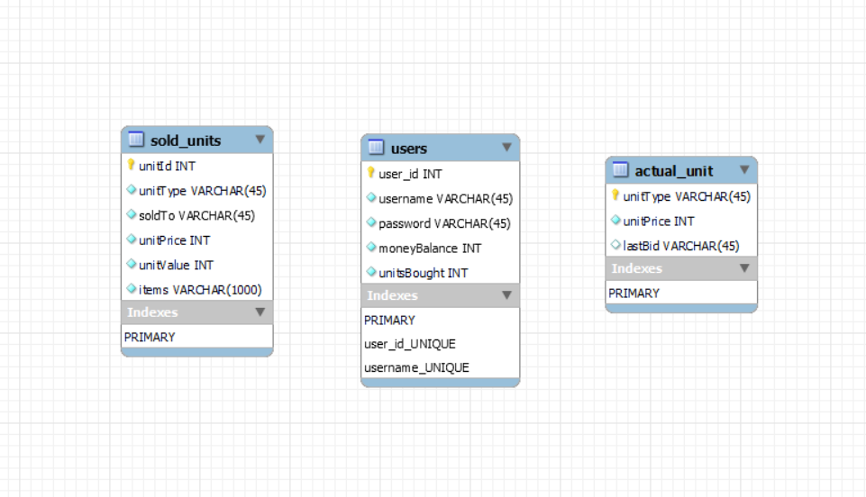

--- 
title: "Storage Unit Auction"
author: "Maroš Bednár"
date: "2022-05-15"
site: bookdown::bookdown_site
documentclass: report
bibliography: [book.bib, packages.bib]
# url: your book url like https://bookdown.org/yihui/bookdown
# cover-image: path to the social sharing image like images/cover.jpg
description: |
  This is a minimal example of using the bookdown package to write a book.
  set in the _output.yml file.
  The HTML output format for this example is bookdown::gitbook,
link-citations: yes
github-repo: rstudio/bookdown-demo
output:  
  github_document:
    toc: true
    toc_depth: 2
  html_document:
    keep_md: true
---

# Project documentation
## Fulfillment of criteria

I have met almost every criterion the professor stated on his website. Also, I have dealt with all of the criteria so I understand them well. Many of them are also applied in the project working version. 

As a result, this project gave me a lot. Now I can say that I understand the database logic, observer patterns and JavaFX graphics GUI. Also, I have met a new program to create a nice documentations in and taught to work with a Virtual Machine. As a big bonus I finally understood that testing is important and without it program cannot be published.

## Certain implementations

I have used inheritance in most of the classes. (Rare, Epic, Mysterious)-Units/Items are all inherited. Polymorphism was applied in Rare, Epic and Mysterious units´ constructors. Aggregation was applied for example to create ActualUnit inside Auction class. All of this is done in the v1.0.0 ProjectFX.

### Main criteria

* encapsulation is user almost everywhere in the code
* polymorphism and inheritance
  * storageUnits.RareUnit.java # 24, # 31
  * storageUnits.EpicUnit.java # 23, # 30
  * storageUnits.MysteriousUnit.java # 24, # 31 
* aggregation
  * auctionClasses.Auction.java # 25, # 29, # 33
  * application.AuctionController.java #59

### Secondary criteria

* Factory pattern
  * auctionClasses.UnitFactory.java # 30
  * auctionClasses.Auction.java # 88
* Strategy pattern
  * auctionClasses.Context.java # 15
  * auctionClasses.OperationAddSubMoney.java # 25
  * auctionClasses.OperationSubMoney.java # 15
  * auctionClasses.OperationAddMoney.java # 15
  * auctionClasses.Auction.java # 187
* Observer pattern
  * auctionClasses.Auction.java # 48
  * application.AuctionObserver.java # 12
  * auctionClasses.User.java # 84
* RTTI
  * auctionClasses.Auction.java # 148
  * auctionClasses.UnitFactory.java # 38
  * storageUnits.CommonUnit.java # 222
* User defined exception
  * application.IncorrectPasswordException.java # 28
  * application.RegistrationController.java # 69
* Serialization
  * application.DBUtils.java # 132 # 133, # 565
* Implicit implementation of the methods inside interface
  * auctionClasses.AuctionFollower.java # 10
  * storageUnits.CommonUnit.java # 64
* Lambda function
  * storageUnits.CommonUnit.java # 185
  * application.EndMenuController.java # 104, # 105, # 106 
* Nested classes and interfaces
  * auctionClasses.Bot.java # 19
* Split GUI and App
  * application.Auction.java 
  * application.AuctionController.java

<!--chapter:end:index.Rmd-->

---
editor_options: 
  markdown: 
    wrap: 72
---

# Project description

## Storage Unit Auction

Project description: This project is being developed in Java in Eclipse
IDE using standard libraries and JavaFX libraries for better GUI.

Project is about buying storage units via auction. Buyers bid some money
and if they hold the highest offer at the end of the selling round,
storage unit becomes theirs. Unit is sold automatically after round
finishes. 

Firstly, registration is needed to create a new account in the auction.

Secondly, if registered ,user must click the start auction button on the screen if he wants to start the current auction. Storage units are generated randomly. Basic one is called a Common Unit and it can be
consisted only of the cheapest Common Items. These items are creating a
storage unit value. Due to it starting price increases. An unit with
higher quality is a Rare Unit and it is consisted of the values from the
Common Unit but contains a new Rare Items with a higher price. The same
rule applies to an Epic Unit with more attributes. For example, Epic
Items. Lastly, unit can become Mysterious. Most profitable items are
stored inside this one. There is some chance to get original items with
enormous value, but also fake ones with minimum price, it is kind of
unfortunate. Items in units have a name and a price. All is generated
randomly so there is a minimum chance to create two same storage units.
To make it authentic, AI is added to compete with a buyer...

## Login functions:

-   Enter username
-   Enter password
-   Starts the auction only if the user was registered
-   Log In button will display an auction window

## Register functions:

-   Name, wich doesnt exist
-   Password, which must contain at least 6 digits containing 1 or
    more numbers, 1 small and 1 capital letter and 1 special character
-   Back to login, returns the user back to login menu
-   Register, uses actual input data to register the user

## Auction functions:

-   Start auction button, starts the timer and the auction
-   Bid \$ button, bids the amount of money displayed, refreshes the
    window
-   Next auction button, finds a next possible unit
-   Log out, logs out the user
-   Statistics, opens the statistics menu where user can view auction details

## Statistics functions:

-   Show all units, shows every sold unit
-   Show my units, shows users units
-   Sell my units, sells only users units
-   New auction, starts a new auction
-   Log out, logs out the user

## List of features for current version v1.0.2

-   Nice GUI
-   Menus: Login menu, Registration menu, Auction menu, Statistics menu
-   Price unit generation
-   MySQL checker for the existing users and storage units
-   Countdown
-   Images

## Important code

* auctionClasses.UnitFactory.generateNewUnit # 30
* auctionClasses.Auction.calculate.java # 185
* storageUnits.CommonUnit.setUnitInfo.java # 200
* application.AuctionController.nextAuction # 229
* application.DBUtils.getConnection.java # 34

## Project Skeleton

Current active UML Class diagram:

Database Schema diagram:

{alt="Project skeleton"}

Brief demonstration of key functionality - Main Prototype:

<!--chapter:end:00_documentation.Rmd-->

# UML diagram {#uml-diagram}

Project contains the following diagrams: <!-- @import "[TOC]" {cmd="toc" depthFrom=1 depthTo=6 orderedList=false} --> <!-- code_chunk_output -->

-   [UML diagram](#uml-diagram)
    -   [Class diagram](#class-diagram)
        -   [Description of classes](#description-of-classes)
<!-- /code_chunk_output -->

## Class diagram {#class-diagram}

### Description of classes {#description-of-classes}

-   Main -- Program starts here and invokes first Auction object
-   Auction -- This is the most important part of the project. Here are connected all unit scripts together. All the important counting happens in here.
-   Generator -- Randomly generates the Units.
-   AuctionController -- Controller for the Auction GUI
-   LoginController -- Controller which creates the user and saves his data
-   User -- Class which creates the user with all needed data
-   Bot -- Basic bot that bids some money in the auction
-   Brain -- Nested class inside bot that distinguishes if bot is smart or not
-   CommonUnit -- Base unit consisted of all important variables such as value, items ... From this one program inherits higher quality units.
-   RareUnit/EpicUnit/MysteriousUnit -- All of those are inherited from the unit with the higher quality. Common \< Rare \< Epic \< Mysterious. Units generate Items of the less or the same value as the unit is.
-   CommonItem -- Base item for other Items, which inherits from this item. It is consisted of ItemName, Price ...
-   RareItem/EpicItem/MysteriousItem -- Inherited items from the CommonItem. They contain the same data but with different values.
-   DBUtils -- Utility class which manages the connections to the database
-   StorageUnitType -- Interface that is part of the Factory pattern
-   AuctionFollower -- Interface that informs users and displays some messages
-   AuctionObserver -- Class that is taking a part in the Observer pattern and creates the main requirements for its children
-   Context -- It handles all strategies and is calling actual function that is about to be executed. Also it is taking a part in the Strategy design pattern
-   UnitFactory -- Class that generates storage units randomly. It is part of the Factory design pattern
-   StrategyAddSubMoney -- Defines what implemented classes should contain. It is taking a part in the Strategy design pattern
-   EndMenuController -- Class that controls end menu statistics
-   RegistrationController -- Class that controls the flow of the registration
-   Initializable -- Class observing all GUI events such as buttons
-   OperationSubMoney -- It creates an operation subtraction. Part of the Strategy design pattern
-   OperationAddMoney -- It creates an operation addition. Part of the Strategy design pattern
-   IncorrectPasswordFormatException -- It is the user defined exception to evaluate the wrong password input error

{alt="image"}

<!--chapter:end:01_uml_diagrams.Rmd-->

# Description of production versions

Project contains the following fully functional versions:

* v1.0.0 - ProjectFX v1.0.0 - basic functionalities
* v1.0.1 - ProjectFX v1.0.1 - improved database
* v1.0.2 - ProjectFX v1.0.2 - final version

## Change log v1.0.0

Miscounting of value possible in version 1.0.0. Also, there are problems with a wallet, you can buy an unit when you do not have money, because you are spending on a different unit.

## Change log v1.0.1

V1.0.1 has added MySQL database and is taking a lot information out of it and storing also in it. It has fixed walled from the v1.0.0
 
## Change log v1.0.2

V1.0.2 is the final version of the project. It contains nice GUI, improved database, function to manage the money balance. Implemented 3 differnet design patterns to control the flow of the project in a good way.

## Version 1.0.0

The first working version of the project. Major errors are replaced and project works well.

Added:

* Base functionality and GUI
* GUI is differed from program logic
* Version contains only user
* Timer

## Version 1.0.1

Second version, also working well with added database.

Added:

* MySQL database
* Improved GUI
* Registration menu

## Version 1.0.2

This is the final working version of the project.

Added:

* Statistics menu
* Different design patterns
* Database checker and updater
* Finished GUI
* Smart bots

<!--chapter:end:02_versions.Rmd-->

# Environment setup

* Eclipse IDE for Java Developers - 2022-03, Release (4.23.0) Build id: 20220310-1457

* JDK 17
* JavaFX 18
* Scene Builder
* mysql-connector-java-8.0.29

## Installation
* Make sure to change the VM Arguments in the project: open project -> Run Configurations -> Select MainRunConfiguration -> Arguments -> now change VM arguments -> --module-path "YOURPATH\\javafx-sdk-18\\lib" --add-modules javafx.controls,javafx.fxml

* Make sure MySQL is installed properly and running at port 3306 with username 'root' and password 'root'

* If on github follow a shared video installation: 

## Database

* I am using MySQL Workbench 8.0
* Login details to the first user: nick: admin pass:admin
* Default collation: utf8mb4_0900_ai_ci
* Default characterset: utf8mb4

<!--chapter:end:03_tech_details.Rmd-->

# Simulation and demonstration of use

{alt="image"}

{alt="image"}

{alt="image"}

If on github watch the instalation video:

If on github watch application usage:

<!--chapter:end:04_simulation_and_demonstration.Rmd-->

# References {-}

<!--chapter:end:07-references.Rmd-->

