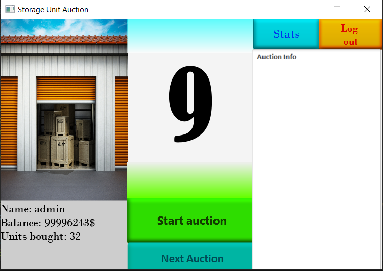

# Maroš Bednár

## Storage Unit Auction
This project is being developed in Java in Eclipse IDE using standard libraries and JavaFX libraries for better GUI.

Project is about buying storage units via auction. Buyers bid some money and if they hold the highest offer at the end of the selling round, storage unit becomes theirs. Unit is sold automatically after round finishes.

Firstly, registration is needed to create a new account in the auction.

Secondly, if registered ,user must click the start auction button on the screen if he wants to start the current auction. Storage units are generated randomly. Basic one is called a Common Unit and it can be consisted only of the cheapest Common Items. These items are creating a storage unit value. Due to it starting price increases. An unit with higher quality is a Rare Unit and it is consisted of the values from the Common Unit but contains a new Rare Items with a higher price. The same rule applies to an Epic Unit with more attributes. For example, Epic Items. Lastly, unit can become Mysterious. Most profitable items are stored inside this one. There is some chance to get original items with enormous value, but also fake ones with minimum price, it is kind of unfortunate. Items in units have a name and a price. All is generated randomly so there is a minimum chance to create two same storage units. To make it authentic, AI is added to compete with a buyer...
## Table of Contents

* [Project documentation](Documentation)
  * [JavaDoc documentation](Documentation/javadoc)
* [UML diagrams](Documentation/images)
* [Versions](Documentation/02_versions.md)
* [Technical details](Documentation/03_tech_details.md)
* [Simulation and demonstration](Documentation/04_simulation_and_demonstration.md)  
  * [Video demonstration](Documentation/04_simulation_and_demonstration.md)

## Fulfillment of criteria

I have met almost every criterion the professor stated on his website. Also, I have dealt with all of the criteria so I understand them well. Many of them are also applied in the project working version. 

As a result, this project gave me a lot. Now I can say that I understand the database logic, observer patterns and JavaFX graphics GUI. Also, I have met a new program to create a nice documentations in and taught to work with a Virtual Machine. As a big bonus I finally understood that testing is important and without it program cannot be published.

## Certain implementations

I have used inheritance in most of the classes. (Rare, Epic, Mysterious)-Units/Items are all inherited. Polymorphism was applied in Rare, Epic and Mysterious units´ constructors. Aggregation was applied for example to create ActualUnit inside Auction class. All of this is done in the v1.0.0 ProjectFX.

### Main criteria

* encapsulation is user almost everywhere in the code
* polymorphism and inheritance
  * storageUnits.RareUnit.java # 24, # 31
  * storageUnits.EpicUnit.java # 23, # 30
  * storageUnits.MysteriousUnit.java # 24, # 31 
* aggregation
  * auctionClasses.Auction.java # 25, # 29, # 33
  * application.AuctionController.java #59

### Secondary criteria

* Factory pattern
  * auctionClasses.UnitFactory.java # 30
  * auctionClasses.Auction.java # 88
* Strategy pattern
  * auctionClasses.Context.java # 15
  * auctionClasses.OperationAddSubMoney.java # 25
  * auctionClasses.OperationSubMoney.java # 15
  * auctionClasses.OperationAddMoney.java # 15
  * auctionClasses.Auction.java # 187
* Observer pattern
  * auctionClasses.Auction.java # 48
  * application.AuctionObserver.java # 12
  * auctionClasses.User.java # 84
* RTTI
  * auctionClasses.Auction.java # 148
  * auctionClasses.UnitFactory.java # 38
  * storageUnits.CommonUnit.java # 222
* User defined exception
  * application.IncorrectPasswordException.java # 28
  * application.RegistrationController.java # 69
* Serialization
  * application.DBUtils.java # 132 # 133, # 565
* Implicit implementation of the methods inside interface
  * auctionClasses.AuctionFollower.java # 10
  * storageUnits.CommonUnit.java # 64
* Lambda function
  * storageUnits.CommonUnit.java # 185
  * application.EndMenuController.java # 104, # 105, # 106 
* Nested classes and interfaces
  * auctionClasses.Bot.java # 19
* Split GUI and App
  * application.Auction.java 
  * application.AuctionController.java

## Login functions:

-   Enter username
-   Enter password
-   Starts the auction only if the user was registered
-   Log In button will display an auction window

## Register functions:

-   Name, wich doesnt exist
-   Password, which must contain at least 6 digits containing 1 or
    more numbers, 1 small and 1 capital letter and 1 special character
-   Back to login, returns the user back to login menu
-   Register, uses actual input data to register the user

## Auction functions:

-   Start auction button, starts the timer and the auction
-   Bid \$ button, bids the amount of money displayed, refreshes the
    window
-   Next auction button, finds a next possible unit
-   Log out, logs out the user
-   Statistics, opens the statistics menu where user can view auction details

## Statistics functions:

-   Show all units, shows every sold unit
-   Show my units, shows users units
-   Sell my units, sells only users units
-   New auction, starts a new auction
-   Log out, logs out the user

## List of features for current version v1.0.2

-   Nice GUI
-   Menus: Login menu, Registration menu, Auction menu, Statistics menu
-   Price unit generation
-   MySQL checker for the existing users and storage units
-   Countdown
-   Images

## Important code

* auctionClasses.UnitFactory.generateNewUnit # 30
* auctionClasses.Auction.calculate.java # 185
* storageUnits.CommonUnit.setUnitInfo.java # 200
* application.AuctionController.nextAuction # 229
* application.DBUtils.getConnection.java # 34

##Brief demonstration of key functionality - Main Prototype:

